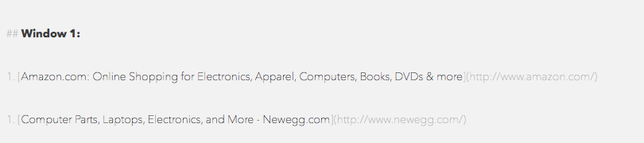
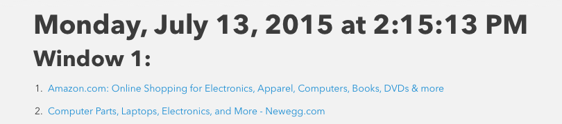

Few days ago while researching about a topic I found myself with a ton of tabs open in Safari. I then wanted to share the said tabs with someone else. Here is how I did it. [^1]

I did a quick Bing [^2] search and found [this](http://veritrope.com/code/export-all-safari-tabs-to-a-text-file/) article on Veritrope. It worked out of the box and did the job for me. But these days, I'm using Markdown to do anything and everything. So naturally, I wanted to edit this script so that it would write the list of URLs to a Markdown file instead of a plain text file. I have very little knowledge of AppleScript but since it is almost like English, I didn't find it hard to follow.

Here is the edited script which saves all the tabs open in all Safari windows to a `.md` file.



Since I thought I would need this feature very often, I decided to assign a shortcut key to it. Now whenever I want to save my present session, I press `⌃S`. That's it. (I have set the default location to be the *Downloads* folder, but you can change it to say, *Desktop* if you want. See line number 58 in the above snippet.) I use the app [Quick Silver](http://qsapp.com) [^3] to do this since it doesn't require a lot of effort to set up.

This is how the saved file looks:

And this is how the HTML looks:

Let me know in the comments below if you found this helpful or if you have any questions.

[^1]: There are a number of ways to do this. You can use extensions for one. Or, if you are using Chrome, you can use [Session Buddy](https://chrome.google.com/webstore/detail/session-buddy/edacconmaakjimmfgnblocblbcdcpbko)

[^2]: I'm *that* guy.

[^3]: This app can be used for a lot of things than just assigning shortcuts to scripts and such. I highly recommend getting the app.